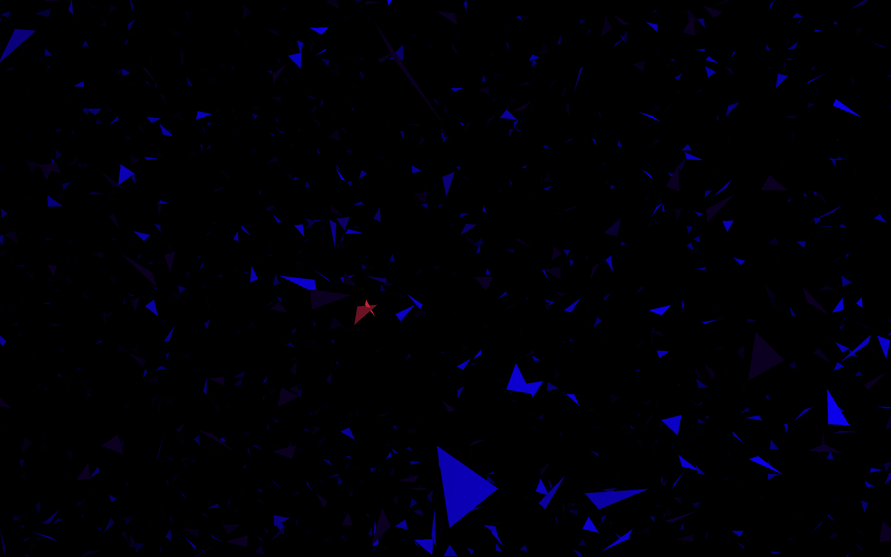

# Vulkan-Triangles

## Введение
В данном проекте реализован второй уровень задачи о [треугольниках](https://github.com/Pelmeshka127/Triangles-3D) - графическая визуализация при попомщи [Vulkan API](https://www.vulkan.org). Для знакомства с вулканом я использовал этот [ресурс](https://www.youtube.com/playlist?list=PL8327DO66nu9qYVKLDmdLW_84-yE4auCR).

## Установка и заупск
Для установки проекта:

```
git clone git@github.com:Pelmeshka127/Vulkan-Triangles.git

cd Vulkan-Triangles
```

Запуск проекта:

```
cmake -B build

cd build

make

./triangles
```

Далее вводится количество треугольников и координаты их вершин.

В результате открывается окно, на котором изображены треугольники синего цвета и пересекающиеся треугольники красного цвета.



Для управления используются следующие клавиши:

```
Вперед              - w
Назад               - s
Влево               - a
Вправо              - d
Вверх               - e
Вниз                - q
Посмотреть вверх    - up button
Посмотреть вниз     - down button
Посмотреть налево   - left button
Посмотреть направо  - right button
```

Приятного просмотра!
